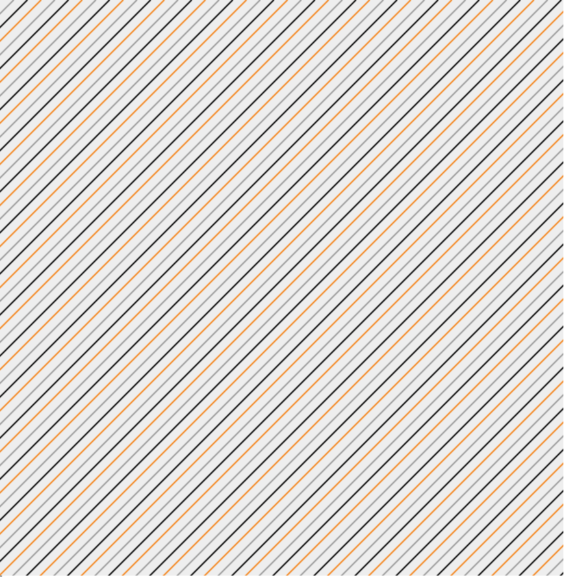
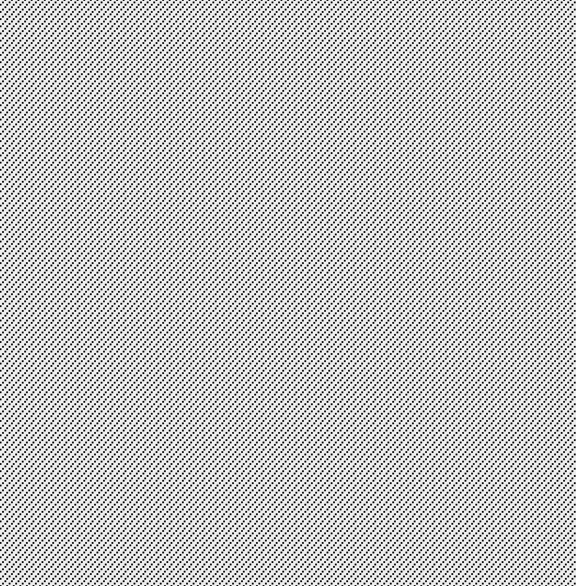
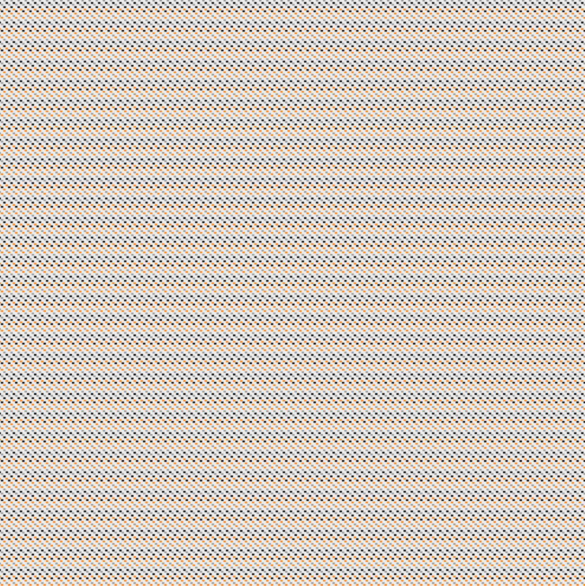

# Bodensee Consulting Patterns

This is a simple patterns generator that conforms to the Coporate Design of the [Bodensee Consulting e.V.](https://www.bodensee-consulting.org/) student consultancy.

It was built for the Interal Project (IP) Whitepaper, which was carried out as part of my candidate phase at the end of the year 2020.

## Usage

### Diagonal stripes pattern

Below pattern can be produced and dynamically adjusted with the code provided in the `BCFazitRahmenMain.java` class.

### Dotted lines pattern

The following two patterns and other similar Variations can be generated by using the `BCMusterMain.java` class.

 

Some documentation on how to control the pattern output can be found in the respective Java code.

## Background story

See the full narrative on my personal website at [lchristmann.com/projects/bodenseeconsulting-project](https://lchristmann.com/projects/bodenseeconsulting-project/).